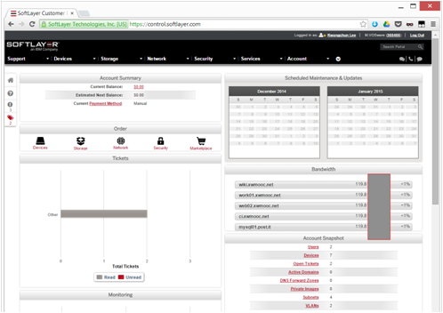
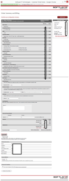
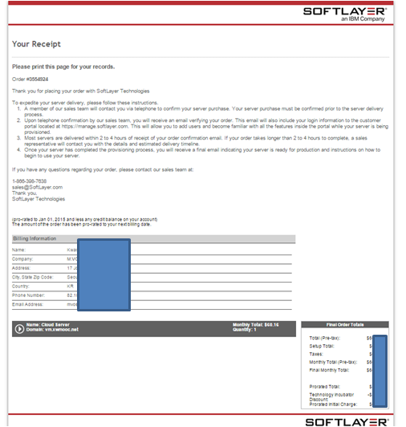
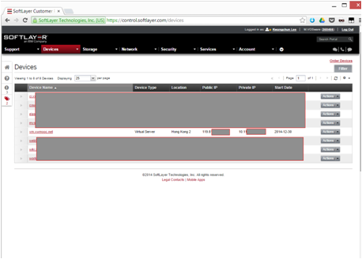
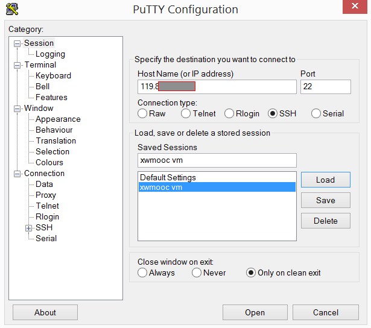
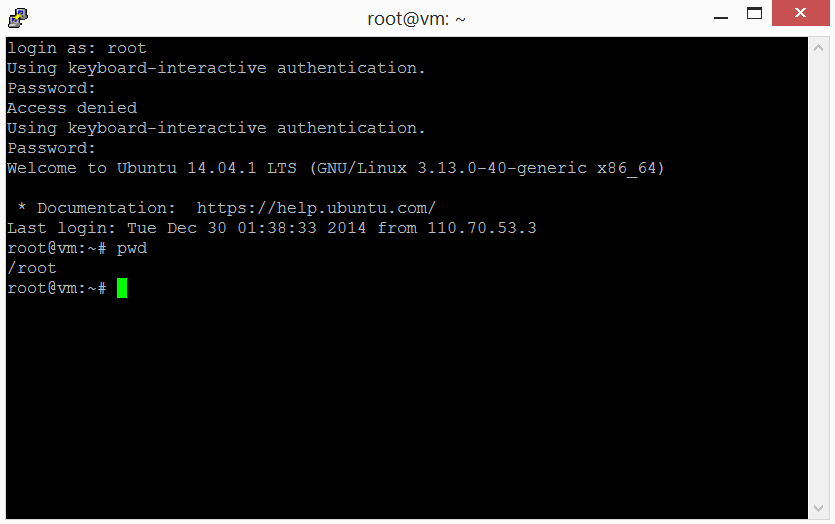
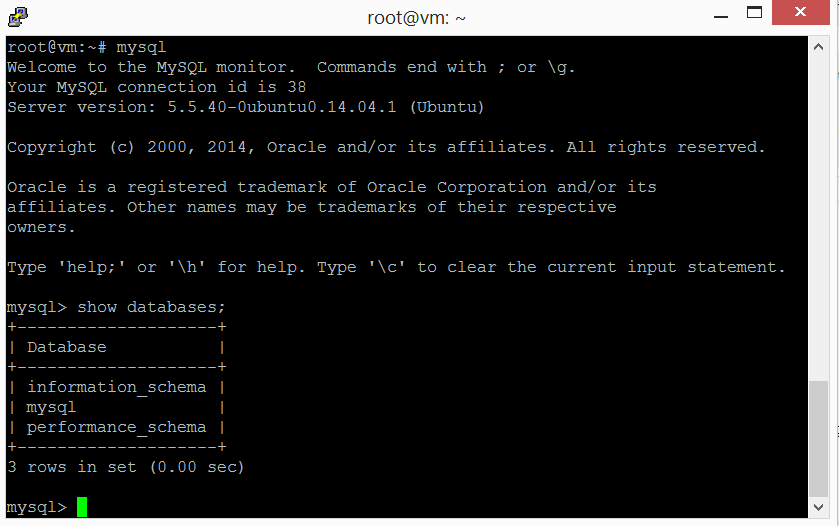
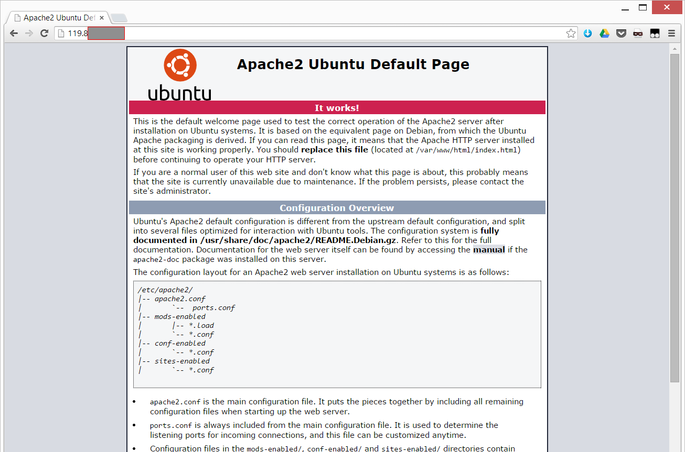

> ## 학습 목표
>
> *   클라우드 서비스 사업자 한곳을 선정 가상컴퓨터를 생성한다.
> *   생성된 가상 컴퓨터에 원격 접속한다.
> *   웹 서비스를 위한 기본환경을 구축한다.
> *   웹 서비스를 띄워 웹 어플리케이션 개발을 위한 준비를 완료한다.

## 클라우드 서비스 사업자
국내외 클라우드 서비스를 제공하는 업체는 다양하며 특정 분야에 전문화된 사업자도 있다.
국내는 KT를 비롯하여 SKT 등 업체가 있고, 글로벌하게는 아마존, IBM, 마이크로소프트, 구글 등이 퍼블릭 클라우드 사업을 추진하고 있다.
클라우드 서비스는 모두 대동소이하여 [IBM Softlayer](http://www.ibm.com/cloud-computing/kr/ko/softlayer.html)를 기준으로 전반적으로 클라우드 서비스를 추진하는 것을 사례로 알아보고자 한다.

## 가상 컴퓨터 생성

1. 클라우드 서비스 사업자 초기 화면 접속한다. [클라우드 서비스 시작하기](http://www.ibm.com/cloud-computing/kr/ko/softlayer.html)
2. 클라우드 서비스 계정에 가입한다. [클라우드 서비스 가입하기](https://www.softlayer.com/promo/freeCloud/freeCloud)
3. 클라우드 서비스 계정에 가입한다. [로그인 하기](https://control.softlayer.com/)
4. 클라우드 서비스 대쉬보드 화면.  

5. 가상 컴퓨터 생성하기
메뉴 상단의 `Account -> Place an Order` 클릭하면 `Order SoftLayer Products and Services` 화면이 나오고 필요한 클라우드 서비스를 선택하여 구매한다. 일단 가상 컴퓨터를 생성해야 하니 `Device -> Virtual Server (monthly)` 를 선택한다.

> 가상 컴퓨터를 생성하는 것은 일반 전자상거래와 마찬가지로 상품을 선택하여 주문서를 작성하고, 장바구니에 담아, 주문을 하면 완료된다. 
> 주문 내역은 빌링 및 구매이력 조회를 통해서 확인한다.  
> ## 가상컴퓨터 구매 {.callout}
>
> 주문서 작성 -> 장바구니 담기 -> 주문/영수증 -> 빌링 및 구매이력 조회

### 가상 컴퓨터 사양 선택 후 확정 

### 가상 컴퓨터 선택 사양 항목 
자신이 원하는 목적의 컴퓨터를 직접 고르는 것으로 과거 용산 전자상가 매장을 일일이 돌아다니면서 중앙처리장치, 주기억장치 용량, 하드디스크 용량, 그래픽 카드, 랜카드 및 필요한 소프트웨어를 설치하는 것을 몇번의 클릭을 통해서 수행할 수 있다. 

* 가상 컴퓨터 수량 : 1 대부터  
* 가상 컴퓨터 지역 : 홍콩, 미국, 유럽 등 가상 컴퓨터 설치 지역  
- 시스템 사양  
    - 중앙처리장치 : CPU 속도, 코어 갯수 등  
    - 주기억장치 : 1 GB, 2GB, ... 등  
    - 운영체제 : 윈도우, 우분투, CentOS, Debian 등  
         - 운영체제과 동시에 LAMP 등 기본 응용프로그램도 가상 컴퓨터 생성할 때 자동으로 설치 할 수 있다.  
* 보조 기억장치 : 통상 하드디스크에 상응하며 주기억장치와 달리 비휘발성으로 자료보관을 위한 저장소로 25GB부터 선택 가능하다.  
* 네트워크 : 네트워크 속도 옵션  
* 시스템 소프트웨어 : 보안, 관리, 데이터베이스, 모니터링 등 기본적인 시스템 소프트웨어를 선택하여 설치한다.  
* 스토리지 : NAS, 백업 등 스토리지를 추가 설치한다.  
* 기타 서비스 : 모니터링, 보험 등 필요한 서비스를 추가 설치한다.  

## 생성된 가상 컴퓨터 확인 
상기 생성한 가상 컴퓨터가 제대로 생성되었는지 `Devices -> Device List` 에서 확인한다.

## 가상 컴퓨터 접속
가상 컴퓨터가 생성되었으면, 다음으로 가상 컴퓨터에 접속을 해야 한다. 윈도우 시스템에서 가상 컴퓨터에 접속하기 위해서는 별도의 프로그램이 필요하다. [puTTY](http://www.chiark.greenend.org.uk/~sgtatham/putty/download.html) 사이트에서 다운로드하여 설치한다.

Public IP 주소를 puTTY에 포트번호 20으로 접속한다. root 사용자로 가상 컴퓨터에 담겨있는 비밀번호를 이용하여 접속한다. 

가상 컴퓨터 생성할 때 LAMP도 함께 설치를 했는데 제대로 설치되었는지 mysql을 통해서 확인해 보자. 정상적으로 우분투 리눅스 운영체제상에서 설치된 것을 확인할 수 있다.

## 웹서비스 테스트
가상 컴퓨터 생성할 때 기본적인 웹서비스를 위한 모든 소프트웨어를 설치했다. 이제 아파치 웹서버를 띄워서 제대로 개발 준비가 되었는지 확인해보자.  

~~~ {.input}
root@vm:~# sudo service apache2 restart
 * Restarting web server apache2                                         [ OK ]
root@vm:~#
~~~

