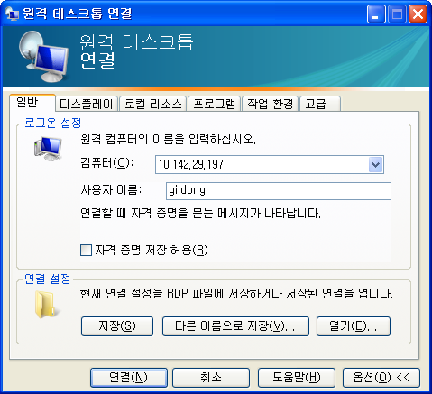

> ## 학습 목표
>
> *   클라우드 리눅스에 CLI 대신 GUI 사용

## 클라우드 리눅스를 원격 연결

클라우드에 가상컴퓨터를 생성한 뒤에 데스크탑 환경을 설치하고 VNC 원격 데스크탑 혹은 [XRDP](http://www.xrdp.org/)를 사용해서 윈도우와 마찬가지로 그래픽 사용자 인터페이스를 이용한다.

~~~ {.input}
sudo apt-get install ubuntu-desktop
sudo apt-get install xrdp
sudo /etc/init.d/xrdp start
~~~

원격 컴퓨터에 우분투 데스크탑 환경을 설치하고 나서 XRDP도 이어서 설치한다.
설치가 완료되면 XRP 응용프로그램을 실행한다.

~~~ {.input}
sudo adduser gildong sudo
~~~

윈도우 `원격 데스크톱연결`을 사용하기 전에 `root`가 아닌 사용자를 `gildong`으로 생성하고 `sudo` 권한도 부여한다.

~~~ {.input}
su gildong
echo "gnome-session --session=ubuntu-2d" > .xsession
~~~

`gildong` 사용자 세션 환경을 지정한다. `nano` 편집기를 사용해서 내용을 `.xsession` 파일에 저장해도 된다.

윈도우에서 클라우드 우분투 가상컴퓨터에 로그인 하기 이해서 `시작` -> `실행`을 클릭하고 `mstsc`를 입력하여 
`원격 데스크톱연결`을 실행한다.

마지막으로 XRDP 로그인 화면이 나오고 비밀번호를 넣게 되면 그래픽 사용자 인터페이스를 원격 컴퓨터에서 이용하게 된다.

