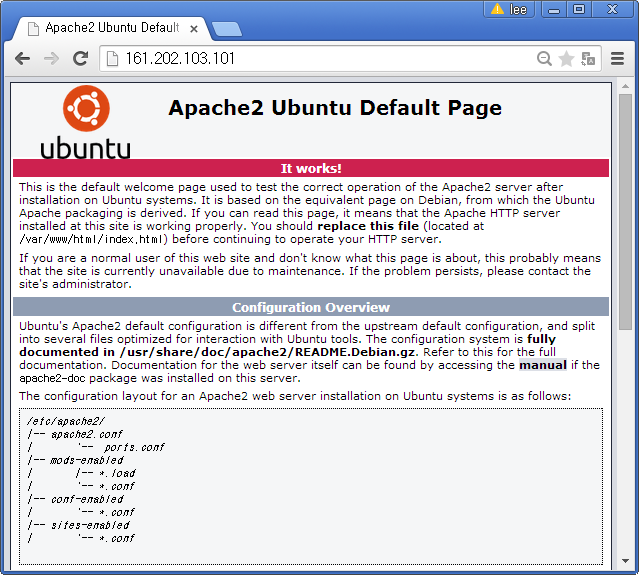

> ## 학습 목표
>
> *   웹앱개발을 위한 LAMP를 설치한다.
> *   간단한 앱개발을 웹앱이 설치된 서버에 올린다.
> *   

## 웹앱 개발을 위한 툴체인(Tool Chain) 설치

웹앱(Web App)은 웹브라우져가 설치된 클라이언트 컴퓨터에서 동작하는 응용프로그램이다. 
통상 웹브라우저에 최적화된 웹(Web) 응용프로그램과 특정 플랫폼에 특화된 앱(App) 응용프로그램을 각각 개발하는 것이 바람직할 수 있지만, 
웹과 특정 플랫폼 앱을 모두 학습하고 경험을 한 뒤에 응용프로그램을 개발하는 입장에서는 여간 시간과 노력이 많이 드는 것이 아니다.

> ## 웹앱(Web Application) {.callout}
>
> 소프트웨어 공학적 관점에서 웹 애플리케이션(web application) 또는 웹 앱은 인터넷이나 인트라넷을 통해 
> 웹 브라우저에서 이용할 수 있는 응용 소프트웨어를 말한다.  
> 출처: 위키피디아 [웹 애플리케이션](http://ko.wikipedia.org/wiki/%EC%9B%B9_%EC%95%A0%ED%94%8C%EB%A6%AC%EC%BC%80%EC%9D%B4%EC%85%98)
>

이것에 비해서 클라이언트에 웹브라우져만 설치되어 있으면 어디서든 동작하게 되는 응용프로그램을 개발하는 것은 매력적이다.
이러한 유형의 응용프로그램을 개발하는데 최적화된 툴체인(Tool Chain)이 LAMP다.

> ## LAMP {.callout}
> LAMP는 웹사이트나 서버 운영에 자주 같이 쓰이는 다음의 소프트웨어들의 이름을 합한 약자다:
> Linux (리눅스 운영체제), Apache (아파치 웹 서버), MySQL / MariaDB 데이터베이스 관리 시스템(데이터베이스 서버),
> PHP, Perl, 또는 Python 프로그래밍 언어.
> 출처: 위키피디아 [LAMP](http://ko.wikipedia.org/wiki/LAMP)

## LAMP 툴체인 설치

### 웹서버 아파치(Apache) 설치

가장 먼저 아파치 웹서버를 설치한다. 웹서버는 웹브라우져 클라이언트에서 HTTP 요청을 받아들여,
주로 그림, 스타일 시트, 자바스크립트를 포함한 HTML 문서를 웹 페이지형태로 클라이언트로 전달하는 것이다.

~~~ {.input}
root@dev:/# sudo apt-get update                           # 최신버젼 설치를 위한 준비
root@dev:/# sudo apt-get install apache2                  # 아파치 웹서버 설치
root@dev:/# sudo apt-get install mysql-server             # MySQL 데이터베이스 서버 설치, root 비밀번호 설정
root@dev:/# sudo apt-get install php5 libapache2-mod-php5 # PHP 설치 
~~~

리눅스(우분투) 환경에서 웹서버, 데이터베이스, PHP를 설치했으면 이제 제대로 설치가 되었는지 확인해보자.
웹서버를 `sudo /etc/init.d/apache2 restart` 명령어로 재가동하고 `ifconfig` 명령어나 
`ifconfig eth1 | grep 'inet addr:'` 을 통해서 ip 주소를 확인하고 웹브라우저에 주소창에
`161.202.103.101`을 입력해서 *Apache2 Ubuntu Default Page*가 보인다면 모든 준비는 완료된 것이다.

~~~ {.input}
root@dev:/# sudo /etc/init.d/apache2 restart
root@dev:~# ifconfig eth1 | grep 'inet addr:'
          inet addr:161.202.103.101  Bcast:161.202.103.127  Mask:255.255.255.224
~~~

## 프론트엔드 앱개발

