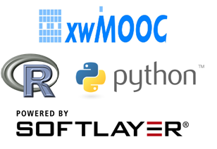

소프트레이어 클라우드 위에서 R과 파이썬으로 [xwMOOC](http://www.xwmooc.net/) 프로그래밍을 시작합니다.

> ## 선수 과목
>
> [컴퓨터 과학 언플러그드](http://www.xwmooc.net/csunplugged/book.html)  
> [러플](http://rur-ple.xwmooc.net/)  
> [파이썬 거북이](http://statkclee.github.io/python-novice-turtles/index-kr.html)  
> [정보과학을 위한 파이썬](http://python.xwmooc.net/)
> [소프트웨어 카펜트리](http://www.xwmooc.net/swc/)

## 학습주제
		
1.  [클라우드란?](01-intro.html)
    - [소프트웨어 이해하기](01-software.html)
    - [클라우드 소개](01-cloud.html)
    - [클라우드 사업](01-cloud-biz.html)
    - [클라우드 아키텍처](01-cloud-arch.html)
2.  [소프트레이어 소개](02-softlayer.html)
    - [소프트레이어 VM](02-vm.html)
    - [원격 로그인, SSH](02-ssh.html)
    - [가상 컴퓨터 GUI](02-xrdp.html)
    - [개발운영(DevOps)](02-devops.html)

3.  [오토스케일링](03-auto-scaling.html)

## [번역 라이센스](license.html)

영어 원문과 동일한 라이센스가 [xwMOOC](http://xwmooc.net/)에서 작업한 한국어 번역 저작물에도 적용됩니다.

